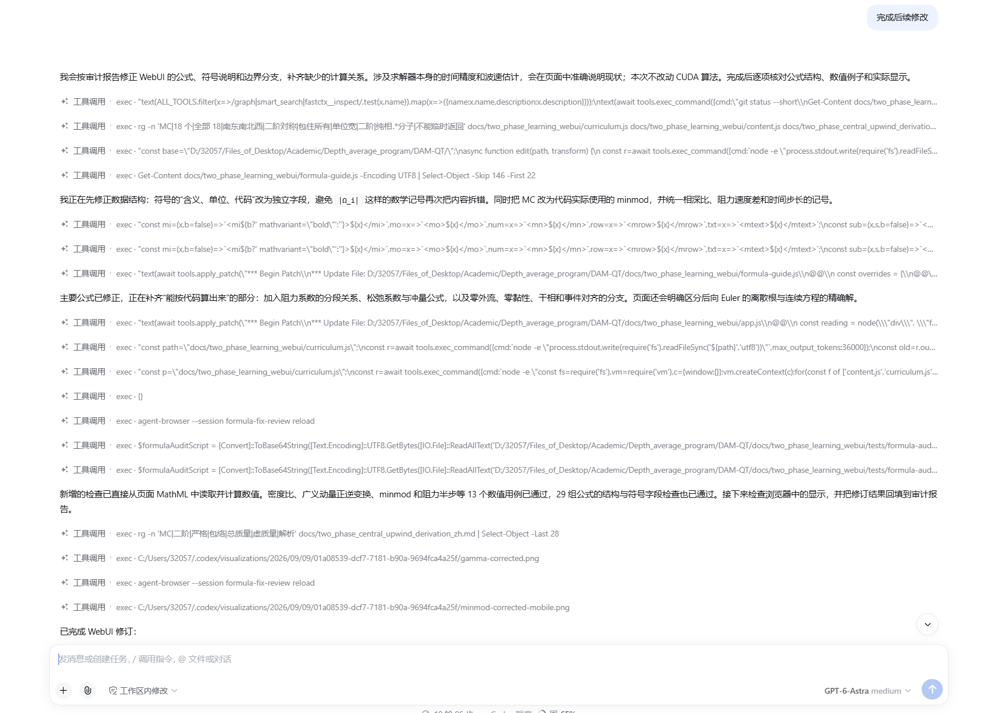
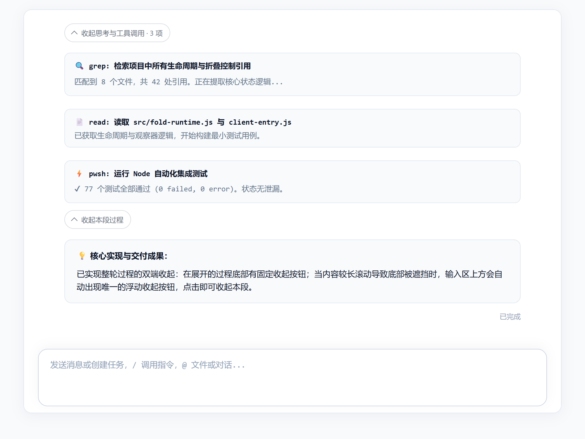
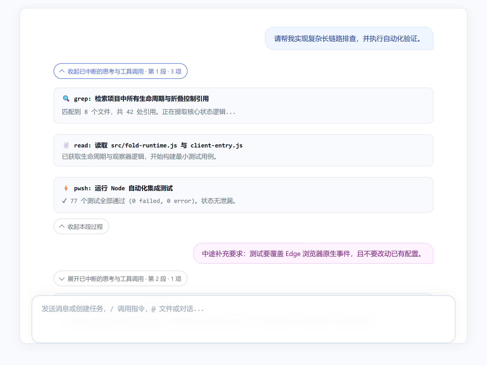
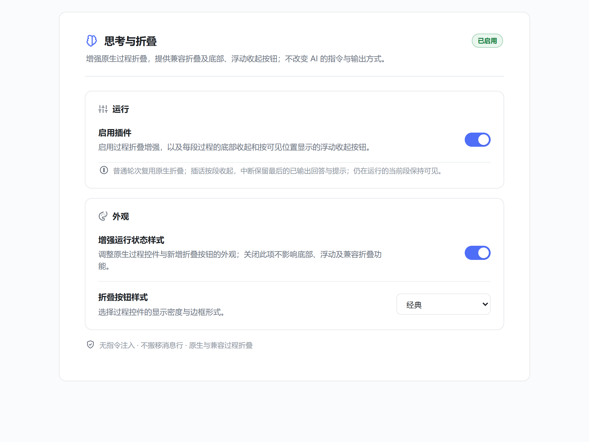

<div align="center">

# dsh-thought-fold

**为 DeepSeek Harness 提供可靠、克制、可恢复的思考与工具过程折叠增强**

让长任务更易阅读，让中途插话和中断过程保持清晰，同时不改变模型指令、回答内容或宿主会话数据。

[](https://github.com/new-Beginner/dsh-thought-fold/releases/latest)
[](LICENSE)
[](package.json)
[](VERIFICATION.md)
[](https://github.com/new-Beginner/dsh-thought-fold)

<br />


<p><em>▲ 安装插件后：老会话及已完成轮次自动收起为紧凑胶囊按钮，界面清爽整洁，核心回答一目了然</em></p>

[效果对比](#showcase) · [功能优势](#features) · [核心交互特性](#interaction) · [安装与更新](#installation) · [配置与设置](#configuration) · [质量与验证](#quality)

</div>

---

<a id="showcase"></a>

## 📸 效果直观对比

在长任务、高频代码重构或多轮工具调用场景下，未折叠的中间过程往往会占据数屏高度，使阅读核心结论和与输入区交互变得极其繁重。

<div align="center">

### 优化前 vs 优化后

| 痛点场景：原始大段过程堆叠 | 解决方案：插件自动紧凑收起 |
| :---: | :---: |
| <br><em>数十个工具调用与思考密集排列，视野被长过程严重占据，查找关键回复极为吃力</em> | <br><em>历史轮次自动折叠为小巧胶囊控件，保留用户问题与最终答复，随时可展开回顾</em> |

</div>

---

<a id="features"></a>

## ✨ 功能优势

| 核心维度 | 关键能力与保障 |
| :--- | :--- |
| **🧠 长过程智能收起** | • 已完成的思考与工具调用默认自动折叠<br>• 用户消息、最终回答与关键状态提示始终完整保留<br>• 老会话加载、历史延迟补载同样自动生效，告别滚动刷屏<br>• 需要细节时一键展开，原汁原味还原工具调用与思考流程 |
| **✂️ 中途插话独立分段** | • 用户中途发送的补充要求（`user` / `steering`）天然成为逻辑分界线<br>• 插话内容始终悬浮在过程组之外，前后两段过程支持**独立展开/收起**<br>• 多次连续插话不会制造冗余空白组，段号与轮次清晰标注 |
| **🛑 中断过程安全整理** | • 任务手动停止、出错或触达长度限制时，自动整理已结束的过程内容<br>• 完整保留中断前最后输出的有效正文卡片与错误状态<br>• 不把断网等待、重试或审批等待误判为中断，保证执行可见性 |
| **📍 双端收起与随行浮动** | • 展开过程底部设有**“收起本段过程”**按钮<br>• 当过程较长被输入框遮挡时，**唯一的浮动收起按钮**自适应吸附在输入区上方<br>• 多组同时展开时互不冲突，收起操作精准对应当前段 |
| **↩️ 状态持久且完全可恢复** | • 页面重绘、动态增高输入区、窗口尺寸变化不会打乱用户手动展开的选择<br>• 原生紧凑与标准模式切换双向保留选择状态<br>• 停用插件或切出时即刻撤销所有显示代理，零残留，零脏数据 |
| **🛡️ 纯 UI 增强，零指令侵入** | • **不向模型注入任何 System Prompt 或隐式提示词**，完全遵循模型原有习惯<br>• **不改写消息 DOM，不破坏 React 节点生命周期**<br>• 仅使用安全的 CSS 标记与局部会话作用域观察，不扫描 `document.body` |

---

<a id="interaction"></a>

## 🎯 核心交互特性

### 1. 展开长过程与底部固定收起

展开思考与工具调用后，卡片采用优雅的边框与清晰的层级展示。在整段过程的最底部，插件注入了符合系统设计语言的 **“^ 收起本段过程”** 按钮。无需费力滑回数千像素之上的顶部，即可就地完成收起。

<div align="center">
  
  <p><em>▲ 展开后的过程卡片流，每段末尾均附有直观的“收起本段过程”按钮</em></p>
</div>

### 2. 输入框上方智能浮动收起代理

当展开的过程非常长、用户正在阅读中间部分导致过程底部被遮挡或滚出视野时，输入框上方会自动出现一枚**全局唯一的浮动收起按钮**：

- **智能跟随**：随页面滚动、窗口宽度变化、输入框被多行文字撑高自适应更新贴边坐标。
- **独占防冲突**：同屏即便存在多个展开组，系统自动判定最贴近视口下沿的目标，绝不叠放多个悬浮按钮。
- **底部就位即让出**：一旦用户滚到最底部，固定按钮进入视野，浮动按钮立即隐去，避免界面元素重复。

### 3. 中途插话自动分段与任务中断整理

中途向智能体发送补充要求（Steering）或临时中断是日常开发的常见操作。2.2.0 对此类非线性交互进行了专门建模：

<div align="center">
  
  <p><em>▲ 针对中途插话（高亮气泡）进行自然分段，插话前已完成步骤收起，插话后继续独立收起，中断状态保留</em></p>
</div>

- **插话外露**：你的补充指令永远不会被折入折叠块内，前后因果关系一目了然。
- **独立控制**：各分段拥有专属的折叠控制权（如“收起第 1 轮第 1 段”），互不干扰。
- **保护部分回答**：任务中途停止或失败后，不会因为没有标准最终锚点而将未完成的过程全盘暴露，同时绝不漏掉已经打印出的部分正文。

---

<a id="configuration"></a>

## ⚙️ 配置与外观风格

插件在 DeepSeek Harness 设置中心无缝注入了 **“思考与折叠”** 专属管理页：

<div align="center">
  
  <p><em>▲ DSH 设置中心专属面板：支持运行时开关与三种视觉风格无缝切换</em></p>
</div>

### 配置项说明

在设置页或通过 `settings.yaml` 配置：

```yaml
dsh-thought-fold:
  enabled: true       # 启用插件核心功能（折叠、底部按钮与浮动代理）
  showLiveHud: true   # 开启视觉增强样式；关闭后依然保留折叠与按钮能力
  foldStyle: codex    # 按钮外观风格：codex (经典) | minimal (极简) | clean (清晰)
```

| 选项 | 说明 |
| :--- | :--- |
| **经典 (codex)** | 经典的胶囊形药丸按钮，半透明磨砂质感与柔和边框，与主流现代 AI 界面高度契合 |
| **极简 (minimal)** | 去除边框与多余底色，纯文本与极简箭头，专注沉浸式代码与对话阅读 |
| **清晰 (clean)** | 微圆角矩形与微底色卡片样式，更明显的视觉点击区域 |

### 快捷斜杠指令

可在输入框直接使用斜杠命令快速查看与控制：

- `/fold status`：查看插件当前启用状态、HUD 样式与外观模式
- `/fold toggle`：一键切换插件的开启与关闭
- `/fold help`：查看指令帮助说明

---

<a id="installation"></a>

## 📦 安装与更新

### 方式一：下载 Release 离线安装包（推荐）

1. 从 [GitHub Releases 页面](https://github.com/new-Beginner/dsh-thought-fold/releases/latest) 下载最新打包文件：
   ```text
   dsh-thought-fold-2.2.0.tgz
   ```
2. 打开 DeepSeek Harness 桌面端，进入左下角 **设置 -> 插件市场 / 插件管理**。
3. 选择“从本地文件安装”，选中下载的 `.tgz` 文件。
4. 安装完成后**重启 DSH** 即可生效。

### 方式二：通过 DSH 命令行添加

```bash
# 适用于 Desktop Profile
dsh plugin --profile desktop add github:new-Beginner/dsh-thought-fold

# 适用于 Web Profile
dsh plugin --profile web add github:new-Beginner/dsh-thought-fold
```

---

<a id="quality"></a>

## 🧪 架构设计与质量保障

为了确保插件长期运行不崩溃、不卡顿、不破坏宿主会话，本项目设立了严格的回归防线：

```text
               ┌───────────────────────────────┐
               │    DeepSeek Harness 宿主      │
               └───────────────┬───────────────┘
                               │ 挂载会话插槽 (Zero DOM Rewrites)
        ┌──────────────────────▼──────────────────────┐
        │        dsh-thought-fold 运行时              │
        ├─────────────────────────────────────────────┤
        │ • 标量事实边界判定 (process-plan.js)         │
        │ • 会话生命周期与布局监听 (fold-runtime.js)   │
        │ • 设置中心与外观样式系统 (client-entry.js)    │
        └──────────────────────┬──────────────────────┘
                               │
       ┌───────────────────────┴───────────────────────┐
       ▼                                               ▼
┌─────────────────────────────┐        ┌─────────────────────────────┐
│    77 项底层与边界测试       │        │    37 项真实 Edge 浏览器测试 │
│  • 标量事实切段判定 (63项)   │        │  • 真实 React 18 节点挂载   │
│  • 设置异步生命周期 (10项)   │        │  • 滚动与浮动按钮精确吸顶   │
│  • 插件元数据与沙箱 (4项)    │        │  • 插话切段与中断保留测试   │
└─────────────────────────────┘        └─────────────────────────────┘
```

- **真实浏览器全场景覆盖**：内置基于 Playwright + 本机 Edge 的真实回归套件（`test/browser.test.js`），涵盖 37 个复杂交互场景。
- **可搜索隐藏支持**：兼容折叠采用 `hidden="until-found"` 与 `content-visibility` 机制，在折叠状态下依然支持浏览器原生 `Ctrl + F` 查找并自动展开匹配段。
- **防内存与事件泄漏**：设置异步请求严格绑定代际 ID，组件卸载即刻中断 AbortController，杜绝延迟回调覆盖新状态。

---

## 📄 开源许可证

本项目采用 [MIT License](LICENSE) 授权开源。欢迎提出 Issue 与 Pull Request 共同改进！
